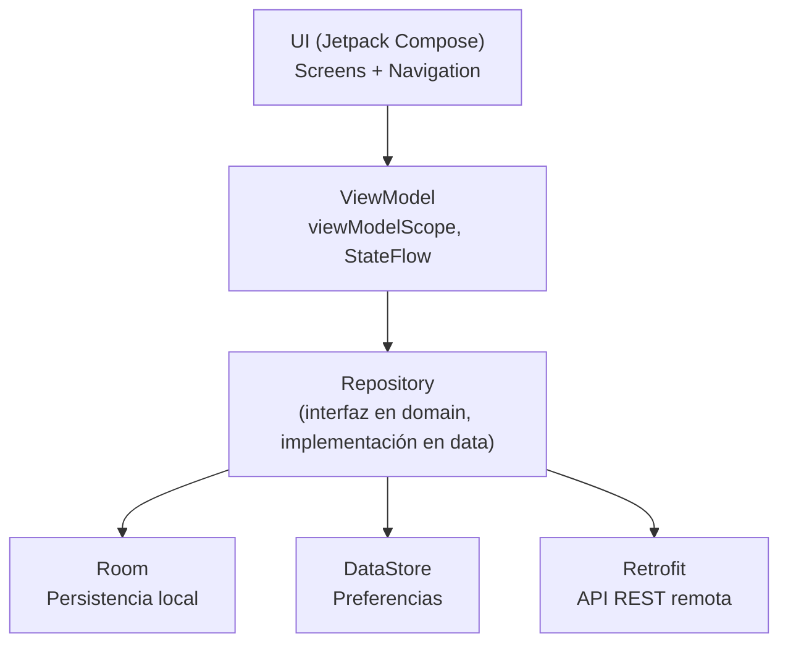

# habitosPLUS

Aplicación Android nativa para el seguimiento de hábitos personales, desarrollada como Proyecto Final de la asignatura **Aplicaciones Móviles**.

Permite crear hábitos propios, marcarlos como cumplidos día a día con evidencia fotográfica, ver el historial y la racha de cumplimiento, y personalizar la experiencia con modo oscuro — todo respaldado por una frase motivacional diaria obtenida de una API externa.

---

## Índice

- [Descripción general](#descripción-general)
- [Tecnologías utilizadas](#tecnologías-utilizadas)
- [Arquitectura](#arquitectura)
- [Estructura de carpetas](#estructura-de-carpetas)
- [Funcionalidades implementadas](#funcionalidades-implementadas)
- [API externa utilizada](#api-externa-utilizada)
- [Persistencia de datos](#persistencia-de-datos)
- [Hardware y permisos](#hardware-y-permisos)
- [Cómo compilar el proyecto](#cómo-compilar-el-proyecto)
- [Generación del .aab / .apk firmado](#generación-del-aab--apk-firmado)
- [Capturas de pantalla](#capturas-de-pantalla)
- [Autor](#autor)

---

## Descripción general

**habitosPLUS** ayuda al usuario a construir hábitos mediante el registro diario de cumplimientos. Cada hábito tiene su propio historial, racha de días consecutivos, y evidencia fotográfica opcional tomada con la cámara del dispositivo en el momento de marcarlo como cumplido.

La app está pensada con una estructura simple e intuitiva:

**Lista de hábitos → Detalle de hábito → Ajustes**, siguiendo el flujo estándar que se trabajó en clase con CineMatch, pero aplicado a un dominio completamente distinto.

---

## Tecnologías utilizadas

| Categoría | Tecnología |
|---|---|
| Lenguaje | Kotlin |
| UI | Jetpack Compose + Material 3 |
| Navegación | Navigation Compose |
| Arquitectura | MVVM + Repository Pattern (Clean Architecture) |
| Persistencia local | Room |
| Preferencias | DataStore |
| Red / API | Retrofit + Gson + OkHttp (logging interceptor) |
| Carga de imágenes | Coil |
| Concurrencia | Kotlin Coroutines + Flow / StateFlow |
| Inyección de dependencias | Contenedor manual (`AppContainer` + `ViewModelFactory`), sin librerías externas |

---

## Arquitectura

El proyecto sigue **Clean Architecture** con tres capas principales, más un módulo de inyección de dependencias:

```
com.adrian.habitosplus/
│
├── data/           → Implementación concreta: Room, Retrofit, DataStore, Repositories
├── domain/         → Modelos puros de Kotlin e interfaces de Repository (sin dependencias de Android)
├── ui/             → Pantallas Compose, ViewModels, navegación y tema
├── di/             → AppContainer (contenedor de dependencias) y ViewModelFactory
└── util/           → Utilidades (ej. creación de archivos para fotos)
```

**Regla de dependencia:** la UI y los ViewModels **nunca** acceden directamente a Room o Retrofit — siempre pasan por una interfaz de `Repository` definida en `domain`, cuya implementación real vive en `data`. Esto permite que la lógica de negocio (`domain`) sea independiente de los detalles técnicos de persistencia o red.

### Diagrama de capas



### Inyección de dependencias

En lugar de usar Hilt u otro framework, el proyecto implementa un contenedor manual simple:

- **`AppContainer`**: construye y expone las instancias de los repositorios (`HabitoRepository`, `QuoteRepository`) y del `SettingsDataStore`, todos conectados a sus fuentes reales (Room, Retrofit, DataStore).
- **`ViewModelFactory`**: sabe qué dependencias inyectar en cada ViewModel según su tipo, permitiendo que Compose los construya correctamente vía `viewModel(factory = ...)`.

---

## Estructura de carpetas

```
app/src/main/java/com/adrian/habitosplus/
├── data/
│   ├── local/
│   │   ├── entities/          → HabitoEntity, RegistroCumplimientoEntity
│   │   ├── HabitoDao.kt
│   │   ├── RegistroCumplimientoDao.kt
│   │   └── AppDatabase.kt
│   ├── remote/
│   │   ├── dto/                → QuoteDto
│   │   ├── ZenQuotesApi.kt      (interfaz Retrofit)
│   │   └── RetrofitInstance.kt
│   ├── preferences/
│   │   └── SettingsDataStore.kt
│   └── repository/
│       ├── HabitoRepositoryImpl.kt
│       └── QuoteRepositoryImpl.kt
│
├── domain/
│   ├── model/                  → Habito, RegistroCumplimiento, Quote
│   └── repository/             → HabitoRepository, QuoteRepository (interfaces)
│
├── ui/
│   ├── navigation/              → Screen.kt, NavGraph.kt
│   ├── screens/
│   │   ├── listahabitos/
│   │   ├── detallehabito/
│   │   ├── agregarhabito/
│   │   └── ajustes/
│   └── theme/
│
├── di/
│   ├── AppContainer.kt
│   └── ViewModelFactory.kt
│
├── util/
│   └── PhotoUtils.kt
│
└── MainActivity.kt
```

---

## Funcionalidades implementadas

- **CRUD completo de hábitos**: crear, listar, editar y eliminar.
- **Historial de cumplimientos** por hábito, con racha de días consecutivos calculada de forma reactiva.
- **Evidencia fotográfica** al marcar un hábito como cumplido (cámara del dispositivo), con posibilidad de reemplazar la foto desde galería y verla ampliada.
- **Imagen de fondo personalizada** por hábito.
- **Frase motivacional diaria** consumida desde una API REST externa, con manejo explícito de los tres estados: cargando, éxito y error.
- **Modo oscuro** persistente, controlado desde Ajustes.
- **Navegación completa** entre 4 pantallas: Lista, Detalle, Agregar/Editar y Ajustes.
- **Confirmación antes de eliminar** un hábito, para evitar borrados accidentales.

---

## API externa utilizada

**FraseDelDia** (`https://frasedeldia.azurewebsites.net/api/phrase`)

API pública y gratuita, sin necesidad de API key, que devuelve una frase motivacional en español junto con su autor. Se eligió sobre otras alternativas (como ZenQuotes) porque devuelve contenido directamente en español, evitando la necesidad de traducción.

El consumo se maneja mediante `Result<Quote>` en `QuoteRepositoryImpl`, lo que permite que la UI distinga explícitamente entre los tres estados requeridos: **cargando**, **éxito** y **error** (por ejemplo, sin conexión a internet).

---

## Persistencia de datos

### Room (datos estructurados)

- **`HabitoEntity`**: información de cada hábito (nombre, descripción, color, fecha de creación, imagen de fondo).
- **`RegistroCumplimientoEntity`**: cada vez que se marca un hábito como cumplido, con fecha y URI de foto opcional. Relacionada con `HabitoEntity` mediante clave foránea con `CASCADE` (al eliminar un hábito, se eliminan también sus registros).

La racha de días consecutivos se calcula combinando de forma reactiva (`combine`) los flujos de ambas tablas, para que se actualice automáticamente tanto al crear/eliminar hábitos como al marcar cumplimientos.

### DataStore (preferencias)

- **`SettingsDataStore`**: guarda la preferencia de modo oscuro (`Boolean`), observada como `Flow` para aplicar el tema en tiempo real desde `MainActivity`.

---

## Hardware y permisos

La app utiliza la **cámara** del dispositivo como funcionalidad de hardware obligatoria:

- Al marcar un hábito como cumplido, se solicita el permiso `android.permission.CAMERA` **en tiempo de ejecución** (no se pide al abrir la app).
- Si el usuario **concede** el permiso, se abre la cámara del sistema y la foto se guarda como evidencia mediante `FileProvider`.
- Si el usuario **rechaza** el permiso, el hábito se marca igualmente como cumplido, sin foto — la app nunca bloquea la funcionalidad principal por falta de un permiso opcional.

---

## Cómo compilar el proyecto

1. Clonar el repositorio.
2. Abrir la carpeta en Android Studio (versión reciente, con soporte para Kotlin 2.2+ y KSP2).
3. Esperar la sincronización de Gradle (descarga automática de dependencias).
4. Ejecutar con ▶ Run sobre un emulador o dispositivo físico con depuración USB habilitada.

No se requiere ninguna configuración adicional ni claves de API — todas las dependencias externas utilizadas son gratuitas y sin autenticación.

---

## Generación del .aab / .apk firmado

Desde Android Studio: **Build → Generate Signed App Bundle or APK...**, seleccionando la variante `release` y la keystore del proyecto (no incluida en el repositorio por seguridad — ver `.gitignore`).

- El `.aab` es el formato de entrega para la Play Store (no publicado, según lo permitido por el silabo).
- El `.apk` se generó adicionalmente para instalación directa en dispositivo físico, con fines de prueba.

---

## Capturas de pantalla

*(Agregar aquí las capturas de: lista de hábitos, detalle con historial y foto, formulario de agregar/editar, y ajustes con modo oscuro activado)*

---

## Autor

**Adrian Arenillo**
Instituto Tecnológico Rumiñahui — Aplicaciones Móviles, Proyecto Final de Semestre.
